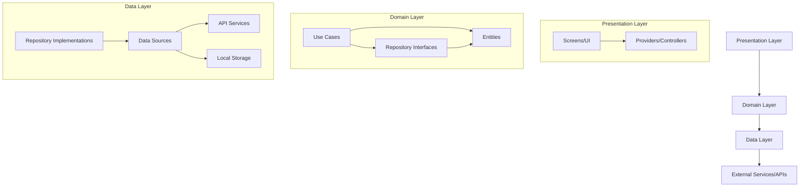
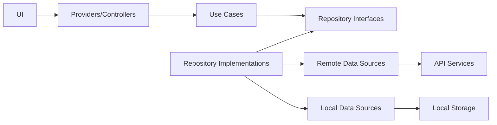
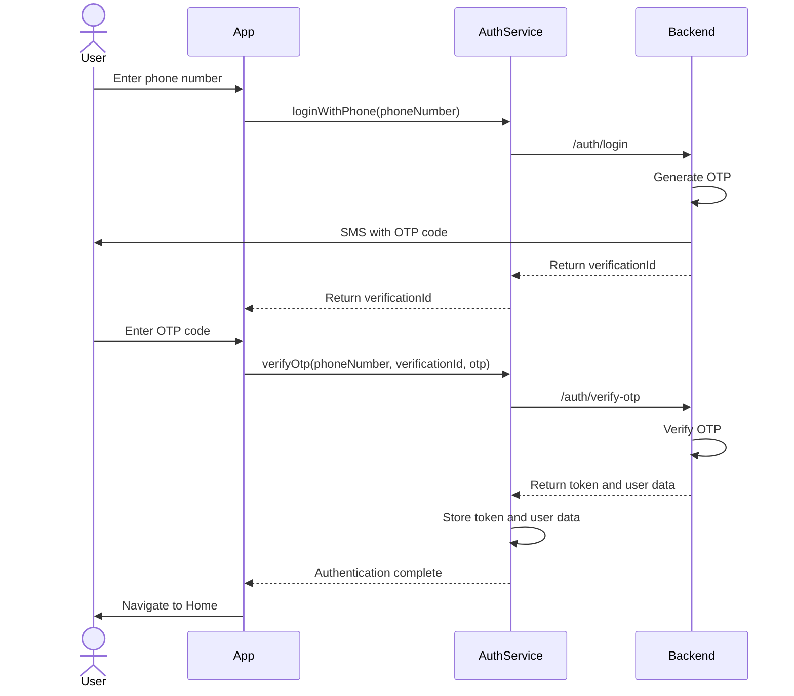
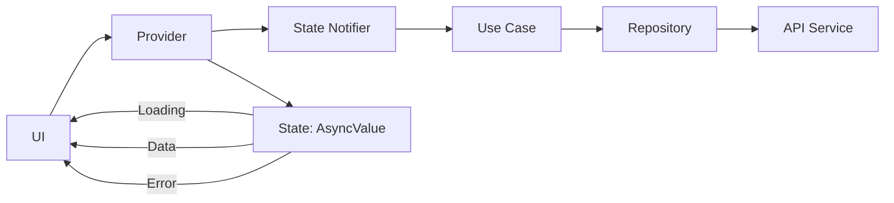
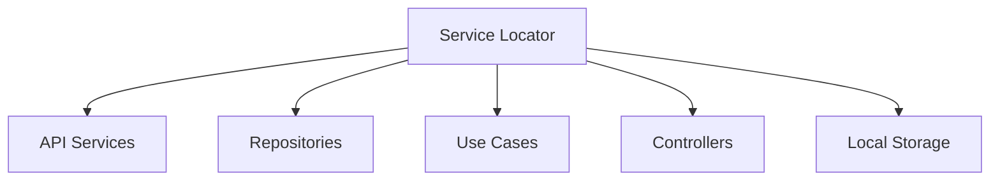
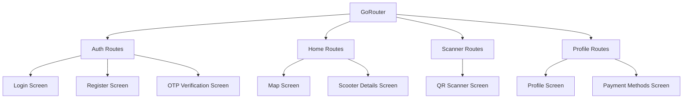

# BarqScoot - E-Scooter Rental/Provider App (similar to Uber)


## Table of Contents

- Overview
- Architecture
  - Clean Architecture
  - Project Structure
  - Dependency Flow
- Key Features
- Authentication Flow
- State Management
- Dependency Injection
- Navigation
- Local Storage
- API Integration
- Error Handling
- Getting Started
- Contributing

## Overview

BarqScoot is a modern e-scooter rental application designed to provide a seamless user experience for locating, reserving, and riding electric scooters. This mobile application is built using Flutter and follows clean architecture principles for maintainability and scalability.

The app allows users to register and login using their phone number via OTP verification, locate nearby scooters, scan QR codes to unlock vehicles, and manage their trips with real-time tracking and payment processing.

## Architecture

### Clean Architecture

BarqScoot implements Clean Architecture principles to ensure separation of concerns, testability, and maintainability:



### Project Structure

The project follows a feature-first organization approach, where each feature is a complete vertical slice:

```
lib/
├── core/
│   ├── configs/
│   │   ├── constants/
│   │   ├── services/
│   │   │   ├── api/
│   │   │   ├── storage/
│   │   ├── theme/
│   ├── di/
│   │   ├── service_locator/
│   ├── error/
│   ├── usecases/
├── features/
│   ├── auth/
│   │   ├── data/
│   │   │   ├── models/
│   │   │   ├── repository/
│   │   │   ├── sources/
│   │   ├── domain/
│   │   │   ├── entities/
│   │   │   ├── repository/
│   │   │   ├── usecases/
│   │   ├── presentation/
│   │   │   ├── providers/
│   │   │   ├── screens/
│   │   │   ├── widgets/
│   ├── home/
│   ├── scanner/
│   ├── etc.
├── common/
│   ├── router/
│   ├── widgets/
├── l10n/
├── utils/
```

### Dependency Flow

The app follows a strict dependency rule where inner layers don't know about outer layers:



## Key Features

- **Authentication**: Phone number based OTP authentication
- **Scooter Locator**: Map integration to find nearby scooters
- **QR Code Scanning**: Scan to unlock scooters
- **Trip Management**: Start, monitor and end rides
- **User Profile**: Management of user data and preferences
- **Payment Integration**: Secure payment processing

## Authentication Flow

BarqScoot uses phone number + OTP verification for secure authentication:



## State Management

BarqScoot uses **Riverpod** for state management:

- **StateNotifier** for complex state management
- **AsyncValue** for handling loading, error, and success states
- **Providers** for dependency injection and scoping

Example of state management pattern:



## Dependency Injection

The app uses **GetIt** and **injectable** for dependency injection:



This allows for:
- Loose coupling between components
- Easy mocking for testing
- Runtime resolution of dependencies
- Singleton and factory patterns as needed

## Navigation

BarqScoot implements **go_router** for declarative routing:



Navigation is handled through:
- Path-based navigation
- Screen transitions with animations
- Deep linking support
- Parameter passing between routes

## Local Storage

BarqScoot uses **Hive** for efficient local storage:

- User authentication tokens
- User profile data
- Application preferences
- Recent ride history

## API Integration

The app communicates with RESTful backend services:

- Authentication endpoints
- Scooter location and availability
- Trip management
- Payment processing

Error handling and retry mechanisms are implemented for robust API communication.

## Error Handling

BarqScoot implements comprehensive error handling:

- API errors with proper user feedback
- Network connectivity issues
- Form validation with helpful messages
- Graceful degradation for offline usage
- Structured error logging for debugging

## Getting Started

### Prerequisites

- Flutter SDK (2.10.0 or higher)
- Dart SDK (2.16.0 or higher)
- Android Studio / VS Code with Flutter extensions
- A physical device or emulator running Android 6.0+ or iOS 12.0+

## License

**PROPRIETARY AND CONFIDENTIAL**

Copyright (c) 2025 BarqScoot. All Rights Reserved.

This software and its documentation are proprietary and confidential information of BarqScoot. 

**RESTRICTIONS:**
- No use, copying, modification, or distribution of this software is permitted
- No reverse engineering, disassembly, or decompilation
- No creation of derivative works
- No transfer of this software to any third party
- No public display or performance

This code base is provided for **reference and review purposes only**. 
Unauthorized use, reproduction, or distribution of this source code, or any portion of it, may result in severe civil and criminal penalties.

THE SOFTWARE IS PROVIDED "AS IS", WITHOUT WARRANTY OF ANY KIND, EXPRESS OR IMPLIED.

Similar code found with 1 license type